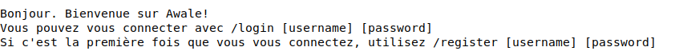
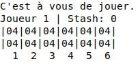

# Jeu d'Awale - Serveur et Client

Serveur de jeu créé pour le jeu Awale, qui comprend un lobby et un système de messagerie.
\
Le client joueur permet de se connecter au serveur et de profiter de toutes les fonctionnalités.

## Installation

Télécharger et extraire l'archive de ce Repo ou cloner le Git avec la commande :
\
``git clone https://github.com/memory5ty7/Awale.git``

Dans le dossier obtenu, ouvrir un terminal de commande et écrire la commande :
\
``make``

Cela compilera le Serveur ainsi que le Client de jeu.

## Démarrage

### Lancement du Serveur

Dans le dossier source, ouvrir un terminal de commande et écrire la commande :
\
``./server/server``

La Serveur de jeu sera alors lancé et accessible via l'adresse IP de l'ordinateur.

### Lancement du Client

Dans le dossier source, ouvrir un terminal de commande et écrire la commande :
\
``./client/player <adresse-IP>`` avec ``<adresse-ip>`` l'adresse IP du serveur.
\
Si on décide de jouer en local, l'adresse IP est 127.0.0.1.

## Instructions

Une fois le Client Joueur lancé, une boîte de dialogue s'affichera vous indiquant que vous êtes bien connecté au Serveur.

### Liste des commandes disponibles

A tout moment, vous pourrez utiliser la commande ``/help`` qui indique la liste des commandes disponibles.

### Enregistrement d'un nouveau joueur

Si vous souhaitez enregister un nouveau joueur dans la Base de Données, effectuez la commande :
\
``/register <username> <password>`` avec ``<username>`` le nom d'utilisateur et ``<password>`` le mot de passe choisi.

- La liste des joueurs enregistrés avec leur mot de passe est disponible dans le fichiers ``users``.
\
 - Le score de chaque joueur (nombre de victoires et de défaites) est enregistré dans le fichiers ``scores``.

### Connexion

Si vous souhaitez vous connecter au serveur avec un utilisateur déjà existant, effectuez la commande :
\
``/login <username> <password>`` avec ``<username>`` le nom d'utilisateur et ``<password>`` le mot de passe de l'utilisateur.

### Se déconnecter

Si vous souhaitez vous déconnecter, effectuez la commande :
\
``/quit``

Cette commande vous déconnecte et ferme le Client.
\
Si vous êtes en cours de partie, le serveur vous enverra un avertisement et vous demandera une confirmation (Quitter une partie en cours est considéré comme une défaite).

### Envoyer un message dans le chat général

Si vous souhaitez écrire un message dans le chat général du jeu, écrivez simplement votre message puis appuyez sur Entrée.
Ce message sera envoyé à tous les joueurs connectés et pas dans une partie en cours.

### Afficher la liste des utilisateurs connectés

Si vous souhaitez afficher la liste des joueurs connectés, effectuez la commande :
\
``/showusers``

Cette commande affiche la liste des utilisateurs connectés, ainsi que leur statut (En ligne, en cours de partie, dans la queue ou en train de regarder un replay).

### Envoyer un message privé à un utilisateur

Si vous souhaitez envoyer un message privé à un autre utilisateur connecté, effectuez la commande :
\
``/msg <username> <message>`` avec ``<username>`` l'utilisateur à qui vous voulez envoyer le message et  ``<message>`` le contenu du message.

Seul l'utilisateur à qui vous envoyez le message privé pourra le voir.

### Afficher la liste des parties terminées

Si vous souhaitez afficher la liste des parties terminées, effectuez la commande :
\
``/showgames``

Cette commande affiche la liste des parties terminées. Ces parties sont disponibles dans le dossier ``games``.
\
Chaque partie a pour nom l'instant à laquelle elle a été lancée (à la seconde près).
\
Chaque fichier contient le nom des 2 joueurs ainsi que la liste de tous les coups effectués.

### Lancer une partie

#### Contre un adversaire aléatoire

Si vous souhaitez lancer une partie, effectuez la commande :
\
``/game``

Cette commande vous placera alors dans une file d'attente et une partie se lancera dès que 2 joueurs seront dans cette file.

Si vous souhaitez quitter la file d'attente, effectuez la commande :
\
``/cancel``
#### Contre un adversaire précis

Si vous souhaitez lancer une partie contre un adversaire précis, effectuez la commande :
\
``/game <username>`` avec ``<username>`` l'utilisateur que vous voulez défier.

Le joueur en question reçoit alors une invitation.
Si vous souhaitez annuler l'invitation, effectuez la commande :
\
``/cancel``

Si vous souhaitez annuler l'invitation, effectuez la commande :
\
``/cancel``

Si vous souhaitez accepter l'invitation, effectuez la commande :
\
``/accept``

Si vous souhaitez refuser une invitation, effectuez la commande :
\
``/decline``
\
Un message sera alors envoyé à l'autre joueur lui indiquant que vous avez déliné son invitation.

### Rejoindre une partie

Si vous souhaitez rejoindre une partie en cours en tant que spectateur, effectuez la commande :
\
``/join <username>`` avec ``<username>`` le nom d'un utilisateur dans la partie.
\
Cette commande fonctionne également si l'utilisateur est un spectateur de la partie.

Vous rejoignez alors la partie au stade actuel et verrez chaque action se dérouler en temps réel et pourrez interragir avec les autres utilisateurs dans le chat de la partie.

### Regarder un replay

Si vous souhaitez regarder un replay d'un partie déjà terminée, effectuez la commande :
\
``/replay <game-id>`` avec ``<game-id>`` l'ID de la partie que vous voulez regarder.

Une fois le visionnage commencé, vous pouvez passer au tour suivant en envoyant un message quelconque dans le chat.

## Déroulement d'une partie

### Affichage du plateau

Une fois une partie lancée, le plateau du jeu Awale s'affiche :

- En haut à droite, le numéro de joueur est affiché. Il indique qui effectue le premier coup de la partie.
- En haut à gauche, le nombre de graines que vous avez collectées est affiché.
- Au milieu, le plateau de jeu est affiché, avec les 6 coupelles de chaque joueur et le nombre de graines dans chacune d'entre elles.
- En bas, les différentes actions possibles sont affichées. Si ce n'est pas votre tour de jouer, un message apparaîtra à la place des nombres des cases.

### Effectuer une action

Lorsque c'est votre tour, vous pouvez sélectionner une de vos 6 coupelles (si la coupelle n'est pas vide).
\
Pour se faire, écrivez tout simplement le chiffre en question.

Une fois l'action effectuée, c'est à l'autre joueur d'effectuer une action.

Le plateau de jeu est affiché à nouveau à chaque fois qu'un joueur effectue une action.

Les règles du jeu d'Awale tel qu'implémenté peuvent être consultées dans le fichier ``rules.md``.

### Envoyer un message dans le chat de la partie

Que vous soyez Joueur ou Spectateur, vous pouvez envoyer un message dans le chat avec la commande :
\
``/chat <message>`` avec ``<message>`` le contenu du message.

Le message sera alors vu par tous les utilisateurs dans la partie (joueurs et spectateurs).

### Fin de partie

Une fois la partie finie, tous les utilisateurs de la partie retournent dans le lobby.
\
Les scores sont également actualisés (nombre de victoires et de défaites).

## Auteurs

- Amaury WILLEM
- Florian LE VASSEUR
